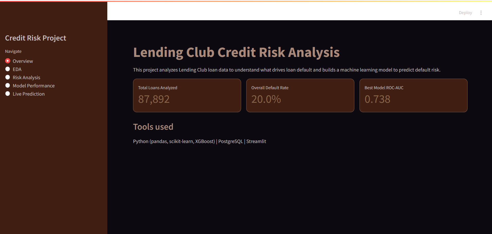
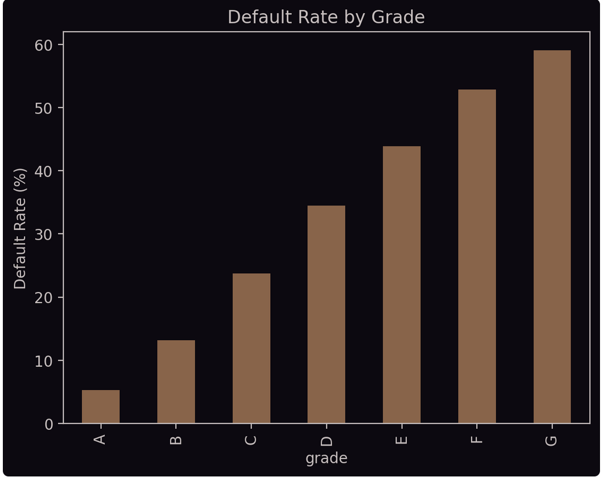
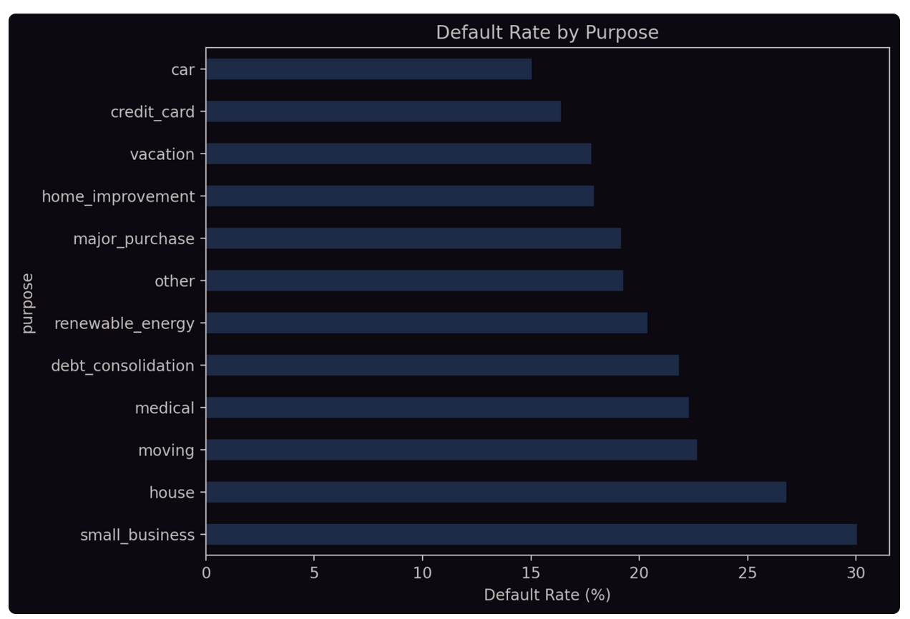
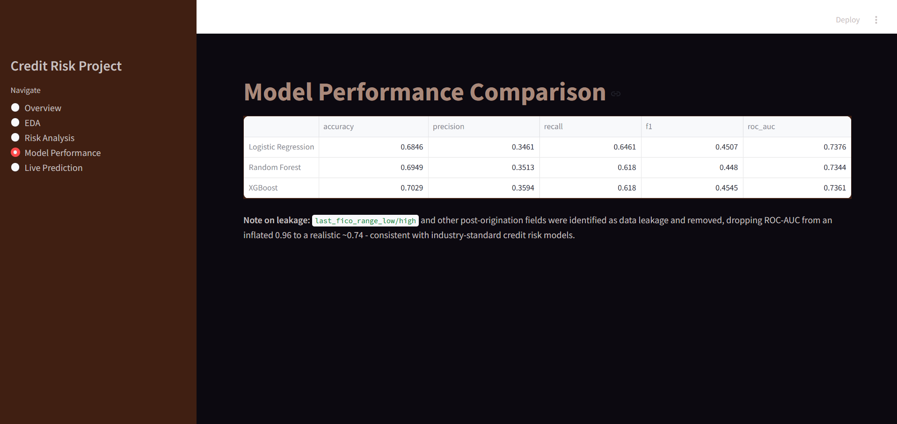
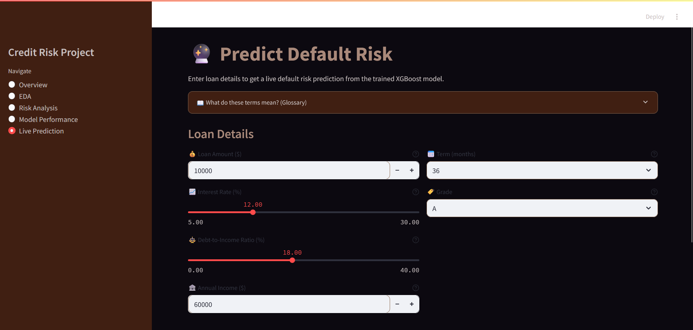
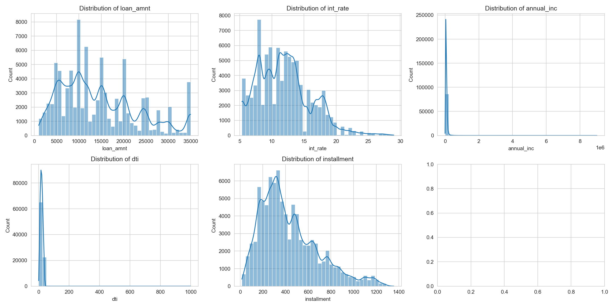
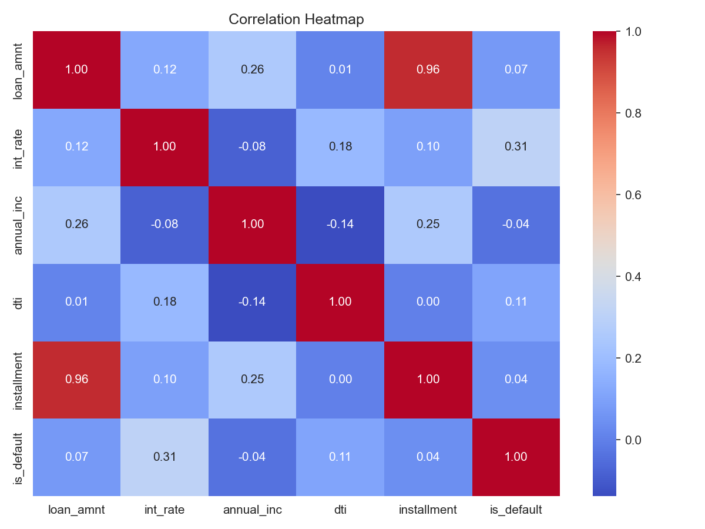
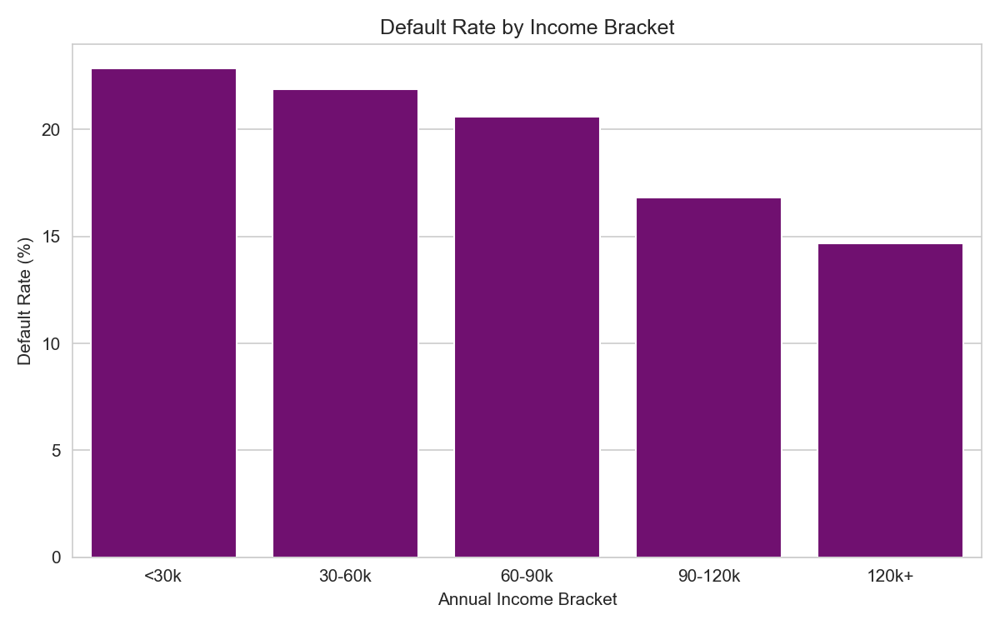
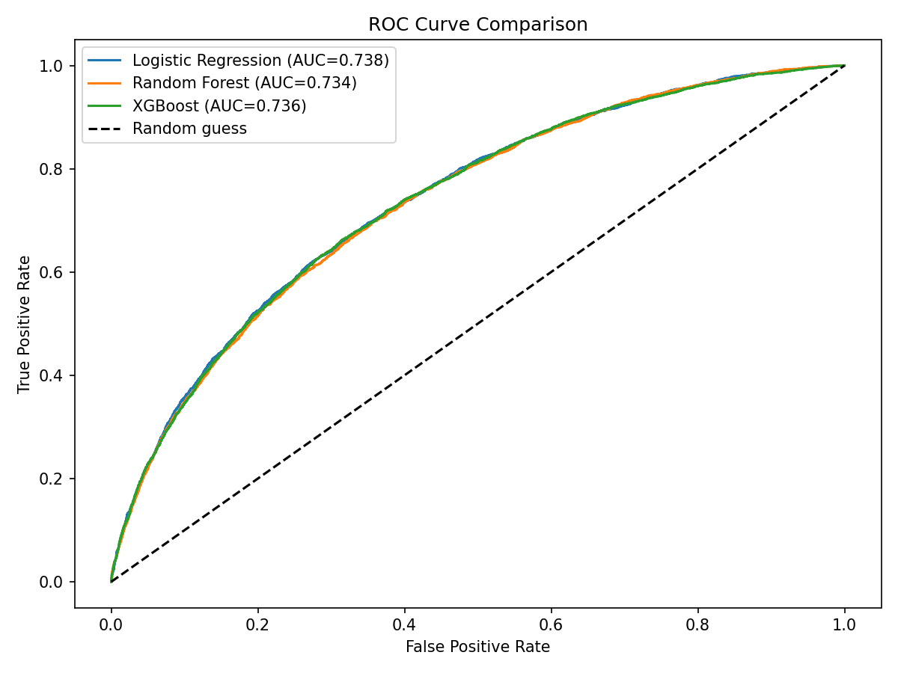
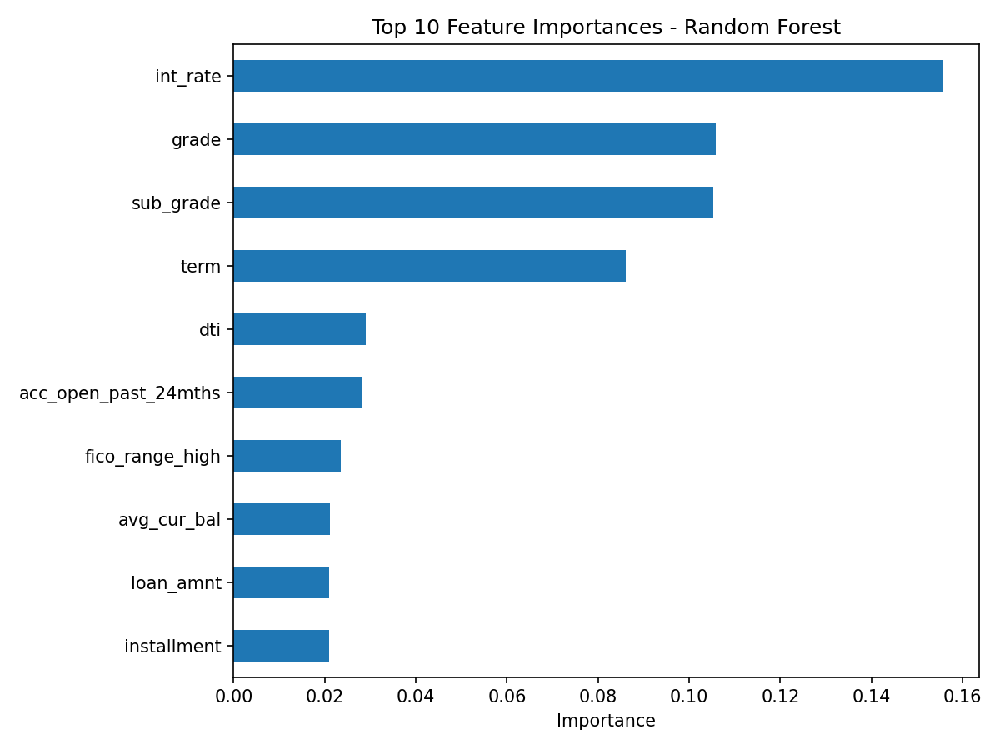

#  RiskLens — Credit Risk Analysis & Loan Default Prediction

> An end-to-end credit risk project: SQL-based analytics, machine learning, and a live interactive dashboard backed by a REST API.


---

##  Live Demo

 **[Open RiskLens Dashboard](https://credit-risk-loan-default-prediction-nebvjbpncpzmhzwqhbdme4.streamlit.app/)**

> **Note:** The prediction API is hosted on Render's free tier and may take 30–60 seconds to wake up on first use after inactivity. This is expected — not a bug.

---

##  Dashboard Preview

### Overview


### Risk Analysis



### Model Comparison


### Live Prediction


---

##  Project Overview

**RiskLens** analyzes ~100,000 sampled loans from the Lending Club dataset to understand what drives loan default, and predicts default risk on new, unseen loan applications in real time.

The project covers the **full data science pipeline:**

```
Raw Data → Cleaning → SQL Analytics → EDA → Feature Engineering → Model Training → API Deployment → Live Dashboard
```

##  Key Findings

| Finding | Detail |
|---|---|
| Overall default rate | ~20% across completed loans |
| Safest loans (Grade A) | ~5% default rate |
| Riskiest loans (Grade G) | ~59% default rate |
| Top predictive features | Interest rate, Grade, Sub-grade, Term, DTI |
| Leakage detected and removed | last_fico_range_low/high inflated ROC-AUC from 0.96 to realistic 0.74 |

---

##  Visualizations

### EDA Distributions


### Correlation Heatmap


### Default by Income Bracket


### ROC Curve Comparison


### Feature Importance (Random Forest)


---

##  Model Performance

| Model | Accuracy | Precision | Recall | F1 | ROC-AUC |
|---|---|---|---|---|---|
| Logistic Regression | 0.68 | 0.35 | 0.65 | 0.45 | 0.74 |
| Random Forest | 0.69 | 0.35 | 0.62 | 0.45 | 0.73 |
| **XGBoost** | **0.70** | **0.36** | **0.62** | **0.45** | **0.74** |

XGBoost was selected as the final model. Given the class imbalance (~20% defaults), all models were evaluated on precision, recall, F1, and ROC-AUC — not just accuracy alone.

**Key decision:** Detected and removed post-origination leakage fields (last_fico_range_low, last_fico_range_high) which caused an artificially high ROC-AUC of 0.96. After removal, ROC-AUC settled at a realistic **0.74**.

---

## Project Pipeline

### 1. Data Cleaning
- Loaded 100,000 rows from the Lending Club accepted loans dataset
- Fixed data types: percentage strings to float, date strings to datetime
- Filled missing values: median for numeric, Unknown for categorical

### 2. SQL Analytics (PostgreSQL)
- Default rate by grade, purpose, and state
- Average interest rate trends by grade
- Cohort/vintage analysis using SQL window functions

### 3. Exploratory Data Analysis
- Distributions of key features (loan amount, interest rate, income, DTI)
- Outlier detection via boxplots
- Correlation heatmap vs default target
- Default rate by income bracket

### 4. Feature Engineering
- Removed 19 leakage columns (post-origination outcome fields)
- Label-encoded categorical features
- 80/20 train/test stratified split

### 5. Model Training and Comparison
- Logistic Regression (industry baseline, most interpretable)
- Random Forest (captures non-linear interactions, gives feature importance)
- XGBoost (best overall performance, industry standard for tabular data)

### 6. Deployment
- Final XGBoost model saved as .pkl via joblib
- Served via FastAPI REST endpoint at /predict
- Streamlit dashboard consumes the API for live predictions

---

##  Tech Stack

| Layer | Tools |
|---|---|
| Data processing | Python, pandas, numpy |
| Database | PostgreSQL, SQLAlchemy |
| Machine learning | scikit-learn, XGBoost |
| Visualization | matplotlib, seaborn |
| API | FastAPI, uvicorn |
| Dashboard | Streamlit |
| Deployment | Render (API), Streamlit Cloud (dashboard) |

---

##  Repository Structure

```
RiskLens/
├── Creditrisk_assets/               # Charts and dashboard screenshots
├── creditrisk_data_cleaning.py      # Data loading and cleaning
├── creditrisk_analysis.py           # SQL analytics queries
├── creditrisk_cohort_vintage_analysis.py   # Vintage analysis
├── creditrisk_eda_analysis.py       # Exploratory data analysis
├── creditrisk_feature_engineering.py       # Feature engineering
├── creditrisk_ml_training.py        # Model training and comparison
├── creditrisk_final_model.py        # Saves final XGBoost model
├── creditrisk_api.py                # FastAPI model-serving endpoint
├── creditrisk_dashboardapp.py       # Streamlit dashboard
├── requirements.txt
├── .gitignore
└── README.md
```

##  Running Locally

```bash
# 1. Clone the repo
git clone https://github.com/nainsy24/credit-risk-loan-default-prediction.git
cd credit-risk-loan-default-prediction

# 2. Install dependencies
pip install -r requirements.txt

# 3. Set database password (Windows)
setx DB_PASSWORD "your_postgres_password"

# 4. Start the API (Terminal 1)
uvicorn creditrisk_api:app --reload

# 5. Start the dashboard (Terminal 2)
streamlit run creditrisk_dashboardapp.py
```

---

##  Notes and Limitations

- Loan amount capped at $40,000 and term restricted to 36/60 months — real Lending Club product constraints
- Dataset is a 100,000-row sample chosen to fit local hardware constraints (8GB RAM)
- Precision on the default class is moderate (~0.35) — the model prioritizes catching more true defaults (recall ~0.62)
- The API on Render free tier sleeps after inactivity — first prediction may take 30 to 60 seconds

---

##  Author

**Nainsy** — [GitHub @nainsy24](https://github.com/nainsy24)

---

*Built as a portfolio project demonstrating end-to-end data science and analytics skills: SQL, Python, machine learning, API development, and dashboard deployment.*
